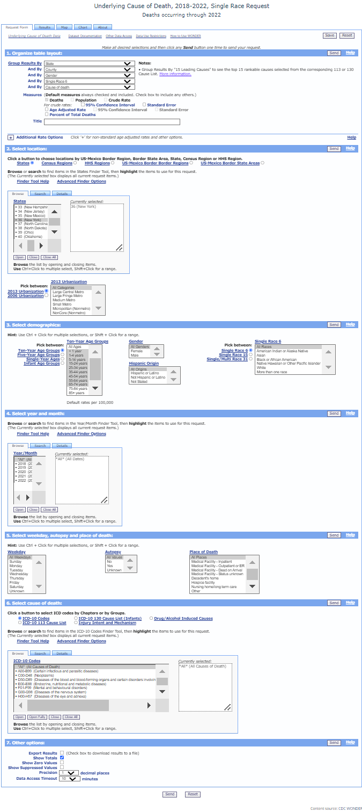

# Assigment Description

**Exploratory analysis and essay**

**Assignment**

1. Choose a dataset
You get to decide which dataset you want to work on. The data set must be different from the ones used in previous homeworks You can work on a problem from your job, or something you are interested in. You may also obtain a dataset from sites such as Kaggle, Data.Gov, Census Bureau, USGS or other open data portals. 
2. Select one of the methodologies studied in weeks 1-10, and another methodology from weeks 11-15 to apply in the new dataset selected.

3. To complete this task:. 
    a. Describe the problem you are trying to solve.
    b. Describe your datasets and what you did to prepare the data for analysis. 
    c. Methodologies you used for analyzing the data
    d. What's the purpose of the analysis performed
    e. Make your conclusions from your analysis. Please be sure to address the business impact (it could be of any domain) of your solution.

**Deliverable**

1. Your final presentation (essay or video) should include:
    1. The traditional R file or Python file and essay,
    2. An Essay (minimum 500 word document) or Video ( 5 to 8 minutes recording)
    Include the execution and explanation of your code. The video can be recorded on any platform of your choice (Youtube, Free Cam).
    
\newpage

# Libraries

```{r, warning=FALSE, message=FALSE}
library(Amelia)
library(car)
library(caret)
library(corrplot)
library(Cubist)
library(DataExplorer)
library(dplyr)
library(e1071)
library(earth)
library(forcats)
library(forecast)
library(fpp3)
library(gbm)
library(ggplot2)
library(ggforce)
library(gridExtra)
library(kableExtra)
library(MASS)
library(Metrics)
library(mice)
library(mlbench)
library(party)
library(psych)
library(pROC)
library(randomForest)
library(RANN)
library(RColorBrewer)
library(readr)
library(readxl)
library(rpart)
library(rpart.plot)
library(stringr)
library(summarytools)
library(tidyr)
library(tidymodels)
library(VIM)
library(earth)
library(randomForest)
```


    

# Overview

Data retrived came from Centers of Disease Control and Prevention website.
The data selected was the 2018-2022 Underlying Cause of Deaths by Single: Race Categories.
The queries completed from this site is limited to 75,000 observations.
In order to limit the data, State was filtered to strictly NYS and data was collected in yearly batches then merged.




# Load Data

We will first load in the data that is required for this analysis. 

```{r, echo=FALSE}
url_git_2018<-"https://raw.githubusercontent.com/GitableGabe/Data624_Data/main/Underlying%20Cause%20of%20Death%2C%202018%2C%20Single%20Race.txt"

url_git_2019<-"https://raw.githubusercontent.com/GitableGabe/Data624_Data/main/Underlying%20Cause%20of%20Death%2C%202019%2C%20Single%20Race.txt"

url_git_2020<-"https://raw.githubusercontent.com/GitableGabe/Data624_Data/main/Underlying%20Cause%20of%20Death%2C%202020%2C%20Single%20Race.txt"

url_git_2021<-"https://raw.githubusercontent.com/GitableGabe/Data624_Data/main/Underlying%20Cause%20of%20Death%2C%202021%2C%20Single%20Race.txt"

url_git_2022<-"https://raw.githubusercontent.com/GitableGabe/Data624_Data/main/Underlying%20Cause%20of%20Death%2C%202022%2C%20Single%20Race.txt"
```


```{r, warning=FALSE}
cdc_ucd_df_2018 <- as_tibble(read_tsv(url_git_2018,
                                 show_col_types = FALSE)
                        )%>%
                          dplyr::select(-1)%>%
                          rename(Race = `Single Race 6`,
                                 `Race Code` = `Single Race 6 Code`)

cdc_ucd_df_2019 <- as_tibble(read_tsv(url_git_2019,
                                 show_col_types = FALSE)
                        )%>%
                          dplyr::select(-1)%>%
                          rename(Race = `Single Race 6`,
                                 `Race Code` = `Single Race 6 Code`)

cdc_ucd_df_2020 <- as_tibble(read_tsv(url_git_2020,
                                 show_col_types = FALSE)
                        )%>%
                          dplyr::select(-1)%>%
                          rename(Race = `Single Race 6`,
                                 `Race Code` = `Single Race 6 Code`)

cdc_ucd_df_2021 <- as_tibble(read_tsv(url_git_2021,
                                 show_col_types = FALSE)
                        )%>%
                          dplyr::select(-1)%>%
                          rename(Race = `Single Race 6`,
                                 `Race Code` = `Single Race 6 Code`)

cdc_ucd_df_2022 <- as_tibble(read_tsv(url_git_2022,
                                 show_col_types = FALSE)
                        )%>%
                          dplyr::select(-1)%>%
                          rename(Race = `Single Race 6`,
                                 `Race Code` = `Single Race 6 Code`)

cdc_ucd_df <- bind_rows(cdc_ucd_df_2018,
                        cdc_ucd_df_2020,
                        cdc_ucd_df_2021,
                        cdc_ucd_df_2022)
```


```{r, echo=FALSE}
rm(list = ls()[!grepl("cdc_ucd_df$", ls())])
```

# Exporatory Analysis (EDA)

First, we can preview our dataset. 

```{r}
glimpse(cdc_ucd_df)
```

The dataset consists of 12,356 rows and 13 columns. Most of the variables are categorical, except for the "Deaths" column indicating the count for this type of observation. 

We can take also take a look at the summary statistics for each of the numeric variables. 

```{r}
describe(cdc_ucd_df)
```

Year is notable being calculated due to its formatting, which will need addressing.Deaths, have a noteable average of 38.16 but a standard deviation of 79.76, indicating a large window of fluctuating deaths.

```{r}
summary(cdc_ucd_df)
```


```{r}
apply(cdc_ucd_df, 2, function(x) sum(is.na(x)))
```


### NA Proportions

We can view if any variable is without NAs below

```{r}
data.frame(missing = colSums(is.na(cdc_ucd_df))) |>
  filter(missing == 0) |>
  rownames()
```

Considering all values have 225 NA, it is important to understand how much this would impact the overall data.

```{r}
plot_missing(cdc_ucd_df, 
             missing_only = T,
             ggtheme = theme_classic(),
             theme_config = list(legend.position = c("right")),
             geom_label_args = list("size" = 3, "label.padding" = unit(0.1, "lines")))
```


```{r, warning=FALSE}
VIM::aggr(cdc_ucd_df, numbers=T, sortVars=T, bars = FALSE,
          cex.axis = .6)
```

We can see that all 11 variables is missing 1.8% of values, which means the NA count of 66 observations noted from the summary is not of great concern, therefore I will actively make the decision to remove it.

```{r}
cdc_ucd_df<-na.omit(cdc_ucd_df)
```


```{r}
# kable(cdc_ucd_df$`Cause of death`, format = "html", row.names = TRUE) %>%
#   kable_styling(full_width = FALSE)
```


### Distributions

We will now take a look at the distributions of the numeric variables. 

```{r}
DataExplorer::plot_histogram(cdc_ucd_df, nrow = 4L, ncol = 4L, ggtheme = theme_classic())
```

It appears none of the numeric values `County Code`, `Population` or `Deaths` is normally distributed 

```{r}
# Create bar plot for gender distribution
ggplot(cdc_ucd_df, aes(x = Gender, fill = Gender)) +
  geom_bar() +
  labs(title = "Gender Distribution", x = "Gender", y = "Frequency") +
  theme_minimal() +  # Change the theme to minimal
  theme(legend.position = "none") +  # Remove legend
  scale_fill_manual(values = c("Male" = "skyblue",
                               "Female" = "pink"))  # Custom fill colors
  

# Create bar plot for race distribution
ggplot(cdc_ucd_df, aes(x = str_wrap(`Race`, width = 10),
                                    fill = `Race`)) +
  geom_bar() +
  labs(title = "Race Distribution", x = "Race", y = "Frequency") +
  theme_minimal() +  # Change the theme to minimal
  theme(legend.position = "none",
        axis.text.x = element_text(angle = 45,
                                   hjust = 1)) +  # Remove legend
  scale_fill_manual(values = c("Asian" = "lightgreen",
                               "Black" = "lightblue",
                               "White" = "lightcoral"))  # Custom fill colors

```

It also appears that deaths among men are higher than women, and among races, more deaths occurred for individuals classified as "white".


```{r, fig.height=9}
# Calculate frequency of each cause of death
top_10_ca_freq<- table(cdc_ucd_df$`Cause of death`)

# Select the top 10 causes of death
top_10_ca <- names(sort(top_10_ca_freq, decreasing = TRUE))[1:10]

# Filter data to include only the top 10 causes of death
top_10_ca_data <- subset(cdc_ucd_df, `Cause of death` %in% top_10_ca)

# Create the plot with sorted values
ggplot(top_10_ca_data, aes(x = reorder(str_wrap(`Cause of death`, width = 23), -table(`Cause of death`)[`Cause of death`]), fill = `Cause of death`)) +
  geom_bar() +
  labs(title = "Top 10 Causes of Death", x = "Cause", y = "Frequency") +
  theme_minimal() +  # Change the theme to minimal
  theme(legend.position = "none", 
        axis.text.x = element_text(angle = 45, hjust = 1, vjust = 1)) +   # Rotate x-axis labels by 45 degrees
  coord_flip()

```

My main concern with the data is the most prominent causes of death in NYC so above I identified the top 10 for 2018-2022, and see if my models will help identify the most prominent causes it expects. I am actually surprised that COVID-19 is not ranked #1 considering the years my dataset consists of.

```{r}
# Calculate frequency of each cause of death by race
ca_freq_rc <- table(cdc_ucd_df$Race, cdc_ucd_df$`Cause of death`,
                    cdc_ucd_df$Gender)

# Convert the frequency table to a data frame
ca_freq_rc_df <- as.data.frame.table(ca_freq_rc)

# Rename columns
names(ca_freq_rc_df) <- c("Race", "Cause","Gender", "Frequency")

# Sort by frequency in descending order
ca_freq_rc_df <- 
  ca_freq_rc_df[order(ca_freq_rc_df$Frequency,
                             decreasing = TRUE),]
```

```{r}
unique(cdc_ucd_df$Gender)
```


```{r,fig.height=8}

# Filter to keep only the top 3 causes of death for each race
top_3_causes <- do.call(rbind,
                        lapply(split(ca_freq_rc_df,
                                     list(ca_freq_rc_df$Race, ca_freq_rc_df$Gender)),
                               function(x) {
                                 race_gender <- unique(x$Race)[1]
                                 gender <- unique(x$Gender)[1]
                                 head(x[order(-x$Frequency), ], 3)
                               }))

top_3_causes_m <- subset(top_3_causes, Gender == "Male")
top_3_causes_f <- subset(top_3_causes, Gender == "Female")
top_3_causes_o <- subset(top_3_causes, Gender == "NA")


# Create the plot for males
ggplot(top_3_causes_m, aes(x = Race, y = Frequency, fill = Cause)) +
  geom_bar(stat = "identity", position = "dodge") +
  labs(title = "Top 3 Causes of Death by Race (Males)", x = "Race", y = "Frequency") +
  theme_minimal() +
  theme(legend.position = "bottom") +  # Position the legend at the bottom
  scale_fill_discrete(labels = function(x) str_wrap(x, width = 10))+  
  # Manually wrap legend labels
  coord_flip()

# Create the plot for females
ggplot(top_3_causes_f, aes(x = Race, y = Frequency, fill = Cause)) +
  geom_bar(stat = "identity", position = "dodge") +
  labs(title = "Top 3 Causes of Death by Race (Female)", x = "Race", y = "Frequency") +
  theme_minimal() +
  theme(legend.position = "bottom") +  # Position the legend at the bottom
  scale_fill_discrete(labels = function(x) str_wrap(x, width = 10))+  
  # Manually wrap legend labels
  coord_flip()

# Create the plot for females
ggplot(top_3_causes_o, aes(x = Race, y = Frequency, fill = Cause)) +
  geom_bar(stat = "identity", position = "dodge") +
  labs(title = "Top 3 Causes of Death by Race (Niether Male or Female)", x = "Race", y = "Frequency") +
  theme_minimal() +
  theme(legend.position = "bottom") +  # Position the legend at the bottom
  scale_fill_discrete(labels = function(x) str_wrap(x, width = 10))+  
  # Manually wrap legend labels
  coord_flip()

```

I looked into how much, top causes of death may vary by race and gender, and decided in my model, going into that level of granularity may not be needed at the present time. I can however explore looking to this at a future date for my own purposes.

```{r}
(unreliable_count <- sum(cdc_ucd_df$`Crude Rate` == "Unreliable", na.rm = TRUE))
```

Crude Rate also appears to have to many `Unreliable` values, approximately 6420, therefore I removed the column altogether.

```{r, echo=FALSE}
rm(list = ls()[!grepl("^cdc_ucd", ls())])

```

# Transformation

## Preprocessing


First redundant categorical data which is any variable labeled `Code`. I also remove 

```{r}
cdc_model<-cdc_ucd_df%>%
                dplyr::select(-c(`Year Code`,`County Code`, `Race Code`,`Gender Code`,`Cause of death Code`, `Crude Rate`))
```

From here, the multiple classifications are set with `as.factor` and `Gender` is simply set to character. From there we preprocess the data, and use `predict()` for our model.

```{r}
cdc_model <- cdc_model %>%
  mutate(
    County = as.factor(`County`),
    Gender = as.factor(Gender),
    Race = as.factor(str_trim(Race)),
    `Cause of death` = as.factor(`Cause of death`),
    Year = as.Date(paste0(Year, "-01-01"))  # Convert Year to Date with January 1st as the date
  ) %>%
  predict(preProcess(., method = c("center", "scale")), .)

```

Running predict to normalize the data made the values appear unlikely with negative decimals. For the purposes of this project I will move forward but resolving this for later interpretation may prove difficult.

# Models

## SVM

SVM is a model that is ideal for high-dimensional data, so I attempted to utilize it for this data set and use of `eps-regression` is based on the fact that the annual data can be considered continous.


```{r, warning=FALSE}
# Set seed for reproducibility
set.seed(1234)
# 
# # Process the data: trim whitespace and convert to factors
# cdc_model <- cdc_model %>%
#   mutate(
#     County = as.factor(str_trim(County)),
#     Gender = as.factor(str_trim(Gender)),
#     Race = as.factor(str_trim(Race)),
#     `Cause of death` = as.factor(str_trim(`Cause of death`))
#   )

# Remove rows with NA values
cdc_model <- na.omit(cdc_model)

# Split the data
training.samples <- cdc_model$Deaths %>%
  createDataPartition(p = 0.8, list = FALSE)

train_df <- cdc_model[training.samples, ]
test_df <- cdc_model[-training.samples, ]

# Identify and remove constant variables in the training set
constant_vars <- sapply(train_df, function(x) length(unique(x)) == 1)
train_df <- train_df[, !constant_vars]

# Ensure the same columns are removed from the test set
test_df <- test_df[, colnames(train_df)]

# Fit the SVM model
svm_model <- svm(formula = Deaths ~ ., data = train_df, type = 'eps-regression')

# Print the SVM model
print(svm_model)

# Predict using the SVM model
predictions_SVM <- predict(svm_model, newdata = test_df)

# Combine predictions with the test dataset
predictions_SVM <- data.frame(Predicted = predictions_SVM, test_df)

# Print predictions
# print(predictions_SVM)


```


**Note**
**SVM-Kernel:  radial** is the default

```{r}
predictions_SVM <- predict(svm_model, newdata = test_df) %>%
  bind_cols(test_df)

predictions_SVM$...1 <- as.numeric(predictions_SVM$...1)
```

### Performance and Comparison

```{r}
MAE <- MAE(predictions_SVM$Deaths, predictions_SVM$...1)
RMSE <- RMSE(predictions_SVM$Deaths, predictions_SVM$...1)
R2 <- R2(predictions_SVM$Deaths, predictions_SVM$...1)

# Create a data frame to store the results
a_svm <- data.frame(Model = "SVM",
                MAE = MAE,
                RMSE = RMSE,
                R2 = R2)

# Print the results
print(a_svm)
```

Not suprisingly the model did very poorly. Choosing a dataset with only 1 numeric value was a drastic change from previous data, therefore learning how to best utilize SVM or manipulate the data for accuracy is something I will look further into.

## Random Forest Regression Tree

Random Forest Regression Tree is an obvious choice considering most of the data is categorical. The only challenge I foresee is creating a clear visual.

```{r}
# Calculate frequency of each cause of death
top_10_ca_freq<- table(cdc_model$`Cause of death`)

# Select the top 10 causes of death
top_10_ca <- names(sort(top_10_ca_freq, decreasing = TRUE))[1:10]

# Filter data to include only the top 10 causes of death
top_10_ca_data <- subset(cdc_model, `Cause of death` %in% top_10_ca)

top_10_ca_data<-top_10_ca_data%>%
                  dplyr::select(-Population)
```


```{r}
set.seed(1234)

cdc_rf_model <- top_10_ca_data 

#split
training_cdc_samples <- cdc_rf_model$Deaths %>% 
  createDataPartition(p = 0.8, list = FALSE)

train_cdc  <- cdc_rf_model[training_cdc_samples, ]
test_cdc <- cdc_rf_model[-training_cdc_samples, ]

#train using rpart, cp- complexity, smaller # = more complexity, 
#method- anova is for regression
tree_cdc <- rpart(Deaths ~., data = train_cdc, cp = 0.004,  method = 'anova')

#visualize
# rpart.plot(tree_cdc)
# print(tree_1k1)   
```

```{r}
# Open a PNG graphics device
png("tree_cdc.png", width = 1000, height = 600, res=300)  # Adjust width and height as needed

# Plot the tree using rpart.plot
rpart.plot(tree_cdc)

# Close the graphics device and save the plot as "tree_cdc.png"
dev.off()

```

Because the Tree model was difficult to see I made it into a PNG. However because of there were an excessive amount of variables, most labels are still difficult to view.The PNG will be provided with my submission.


```{r}
# Open a PNG graphics device with high resolution
png("tree_cdc_hd.png", width = 2040, height = 1200, res = 300)  # 300 DPI

# Plot the tree using rpart.plot with custom text settings
rpart.plot(tree_cdc, extra = 101, type = 3, under = TRUE,  faclen = 0, varlen = 0, snip = TRUE,
           cex = .3, # Increase font size
           branch.lty = 1, branch.lwd = .5, # Set branch line type and width
           main = "Decision Tree for CDC Data", # Add a main title
           split.cex = .5, split.box.col = "lightblue", split.border.col = "blue") # Customize split nodes

# Close the graphics device and save the plot as "tree_cdc_hd.png"
dev.off()

```


**Predictions**

```{r message=FALSE, warning=FALSE, results='hide'}
predictions_tree <- predict(tree_cdc, newdata = test_cdc) %>% 
  bind_cols(test_cdc )

predictions_tree$...1 <- as.numeric(predictions_tree$...1)

```

```{r}
decision_tree_model <- data.frame(Model = "Decision Tree 1",

MAE = ModelMetrics::mae(predictions_tree$Deaths, predictions_tree$...1),
#rmse Root Mean Squared Error
RMSE = ModelMetrics::rmse(predictions_tree$Deaths, predictions_tree$...1),
#r squared
R2 = caret::R2(predictions_tree$Deaths, predictions_tree$...1)
)

decision_tree_model
```
# Essay

The objective of my project is to utilize recent mortality data to train a model that can potentially predict its impact on specific demographics. The data was sourced from the Center for Disease Control (CDC) website, specifically from the dataset titled “2018-2022 Underlying Cause of Death by Single Race Categories.” This dataset is primarily categorical, presenting a personal challenge since my previous work throughout the semester primarily involved numerical data.

This project aims to identify underlying causes of death that may disproportionately affect different communities. Factors such as social disparity, limited access to healthy foods, excessive access to fast food, limited access to parks and outdoor activities, and availability of sports facilities by region could all be contributing factors. Although this project does not delve into these specific factors, it applies the skills learned this semester to localize these underlying causes of death by county and demographic. Visualizations created for race and gender groupings illustrate the potential of this data to inform stakeholders and decision-makers, with the goal of improving the lives of various regions and communities.

Data collection faced obstacles due to the CDC website’s maximum query output of 75,000 observations. To mitigate this challenge, the data was limited to New York State and collected in annual batches before merging. During my exploratory data analysis (EDA), I prioritized data integrity, assessing for missing values and identifying 225 NA observations. Given their negligible impact on the dataset, these observations were omitted from the models. The numerical data included deaths and population counts, which were not normalized. With an average death toll of 38 and a standard deviation of 79, there was concern about the model's fit. Plotting the distributions confirmed that the death count was right-skewed and not normalized.

All categorical data included both coded and descriptive text formats. For this project, the descriptive text was used to enhance readability. Redundant codes were removed, categories were set as factors, and the year was treated as a date value for preprocessing.

Given that Support Vector Machine (SVM) models perform well with high-dimensional data, I employed this technique for the dataset. Based on guidance from R documentation and Stack Exchange sites, I determined that 'eps-regression' was the optimal parameter for the 'type' argument, considering the continuous nature of the annual data. However, the results were as follows:

| Model          | MAE   | RMSE   | $R^2$ |
|----------------|-------|--------|-------|
| SVM            | 0.4065| 1.0890 | 0.2689|


The SVM model proved to be a poor fit.

Subsequently, I utilized a random forest model, generating the image tree_cdc_hd.png to better visualize the results. The results were:

| Model          | MAE   | RMSE   | $R^2$ |
|----------------|-------|--------|-------|
| Decision Tree 1| 0.4034| 0.8857 | 0.6272|


The decision tree model demonstrated a better fit compared to the SVM model.

In this project, I deliberately retained the noted errors as learning opportunities for future endeavors. Firstly, while I believe my data selection was appropriate, I need to further investigate the transformation of numerical values. Specifically, the normalization process via the predict() function resulted in negative decimal values, posing a challenge in accurately predicting future outcomes. Additionally, using the Code definitions for categories in the Random Forest model could have enhanced the model's visualization. However, this introduced interpretation challenges. Moving forward, I intend to continue refining this dataset to address these common interpretative issues, thereby improving the clarity and utility of my models in similar future projects.


<!------- Below is for removing excessive space in Rmarkdown | HTML formatting -------->

<div class="tocify-extend-page" data-unique="tocify-extend-page" style="height: 0;"></div>

